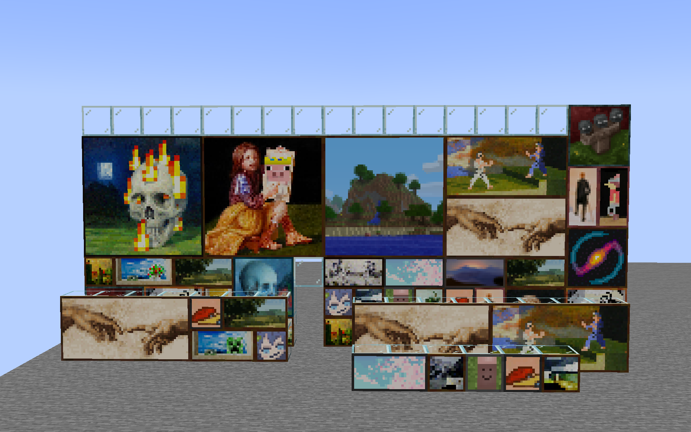
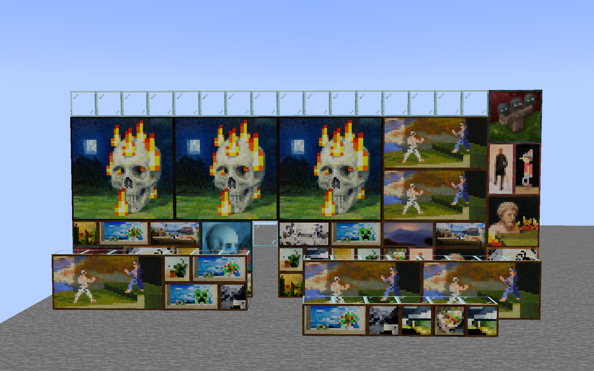

# Client Paintings

Client Paintings is a simple, *fully client-side* mod to add 
new paintings via resource packs while keeping the vanilla paintings intact.
It achieves this by looking at the UUID of the painting entity and
applying a pseudo-random algorithm to it to determine which painting to render.

## Features

- Add multiple new sets of paintings via resource packs
- Keep the vanilla paintings intact
- When a vanilla painting is shown, it will match the vanilla painting seen by players without the mod
- Custom paintings shown will match the custom paintings seen by other players with the mod
- Custom paintings are fully persistent between relogs and server restarts

## Caveats

- Custom paintings will only match up between players if they both use the exact same painting sets
- Painting sets have to be added via a custom resource pack format, see below for details

## Example

With the included default resource pack:



What vanilla players see:



## Resource pack format

A resource pack converter is being worked on, but for now, you will have to manually create
a resource pack to add custom paintings.

The resource pack format is very simple. It consists of a single `client_paintings` folder
located in the root of your resource pack namespace (e.g. `assets/<namespace>/client_paintings`).
Inside this folder, you can place any number of json files, each representing a custom painting.

Each json file must have the following structure:

```json
{
  "texture": "<namespace>:paintings/painting_texture",
  "back": "<namespace>:paintings/painting_back_texture",
  "size": [2, 1]
}
```

- `texture` is the texture of the painting, it must be a png image with a ratio matching the `size` field, 
  with width and height both being a multiple of 16. The texture can be located anywhere within 
  the `assets/<namespace>/textures` folder.
- `back` is the texture of the back of the painting, it must be a square png image with similarly, a width and height
  being a multiple of 16.
- `size` is the size of the painting in blocks, the first value is the width, the second value is the height.
  Do note only 1x1, 1x2, 2x1, 2x2, 4x2, 4x4, and 4x3 size paintings are supported due to the need to replace
  a vanilla painting.

An example resource pack structure would look as follows:

```text
pack.mcmeta
assets
└── namespace
    ├── textures
    │   └── paintings
    │       ├── painting1.png
    │       ├── painting2.png
    │       ├── painting3.png
    │       └── backs
    │           ├── back1.png
    │           └── back2.png
    └── client_paintings
        ├── painting1.json
        ├── painting2.json
        └── painting3.json
```

The source for the default included pack can be easily browsed 
[here](https://github.com/enjarai/client-paintings/tree/master/src/main/resources/resourcepacks/default).
